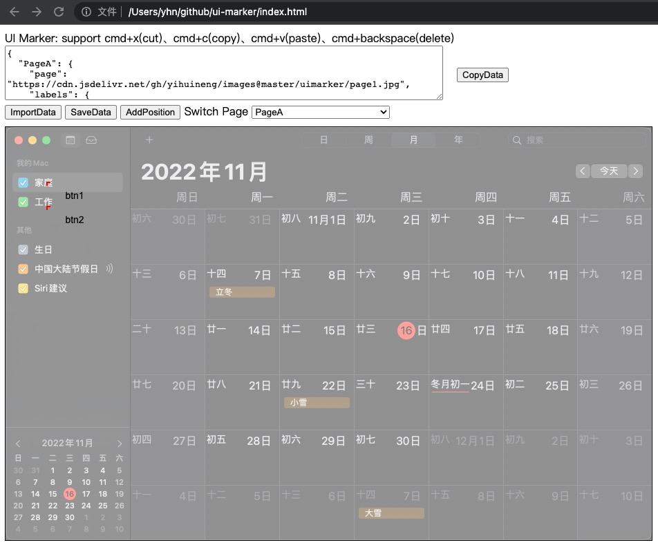

## UI Marker
### help you manage UI positions easily.



## usage
### [online tool](https://yihuineng.github.io/ui-marker)

### local
- open index.html in browser.
- import JsonData like this
```json
{
  "page1": {
    "page": "img_url1",
    "labels": {
      "btn1": "100,200",
      "btn2": "200,200"
    }
  },
  "page2": {
    "page": "img_url1",
    "labels": {
      "btn3": "100,200",
      "but4": "300,200"
    }
  }
}
```
